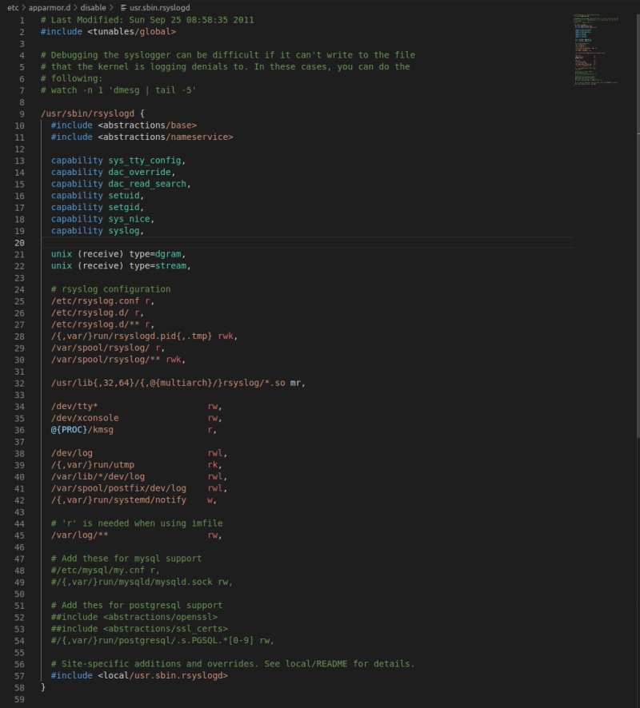

# vscode-apparmor

VS Extension to integrate [AppArmor](https://gitlab.com/apparmor/apparmor/wikis/home) into Visual Studio Code. 

## Features

- Syntax highlighting
- Snippets for creating new
    - Network rules
    - Alias rules
    - Deny/Allow file rules
    - Audit rules
    - Empty policy files
- Highlighting of dangerous capabilities

## How to use

To enable this extension, [set the current language](https://code.visualstudio.com/docs/languages/overview#_changing-the-language-for-the-selected-file) to AppArmor. 

Here's an example of a rsyslogd profile being highlighted by this extension:

### AppArmor Resources 

Whilst using this extension you may find interesting the resources below to help create and maintain your apparmor profiles:

* [OpenSuse: AppArmor Profile Components and Syntax](https://doc.opensuse.org/documentation/leap/security/html/book-security/cha-apparmor-profiles.html)
* [AppArmor: Core Policy Reference](https://gitlab.com/apparmor/apparmor/wikis/AppArmor_Core_Policy_Reference)
* [AppArmor: Manually profiling applications](https://gitlab.com/apparmor/apparmor/wikis/Profiling_by_hand)
